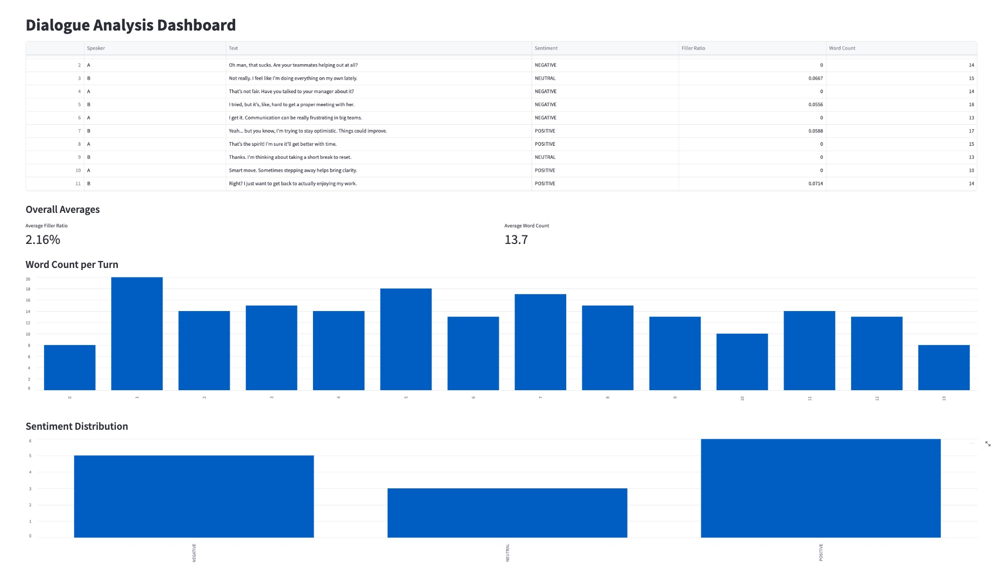

# Dialogue Analysis Dashboard

This self-contained Python application loads a transcript of a conversation, analyzes each turn for sentiment and filler-word ratio, and displays an interactive report with per-turn metrics and overall averages. A creative extension (word count bar chart) is also included.

## Setup & Installation

1. **Clone the repository**
2. **Create and activate a virtual environment:**
   ```bash
   python3 -m venv venv
   source venv/bin/activate
   ```
3. **Install dependencies:**
   ```bash
   pip install -r requirements.txt
   python -m spacy download en_core_web_sm
   ```
4. **Run the app:**
   ```bash
   streamlit run app.py
   ```

## Files
- `transcript.txt`: Sample dialogue with filler words
- `analysis.py`: Functions for parsing, sentiment, filler ratio, and word count
- `app.py`: Streamlit dashboard
- `requirements.txt`: All dependencies
- `README.md`: Project documentation

## Metrics
- **Sentiment**: Per-turn sentiment (POSITIVE, NEGATIVE, or NEUTRAL) via Hugging Face Transformers (`cardiffnlp/twitter-roberta-base-sentiment-latest`)
- **Filler-Word Ratio**: Number of filler words divided by total words (spaCy + regex)
- **Word Count**: (Creative extension) Number of words per turn, visualized as a bar chart
- **Averages**: Overall averages for filler ratio and word count

## In one extra hour I would add…
- **Speaker-level trend analysis:** Visualize how each speaker's sentiment and filler-word usage changes over the course of the conversation, possibly with line charts or moving averages.

## Sample Output


